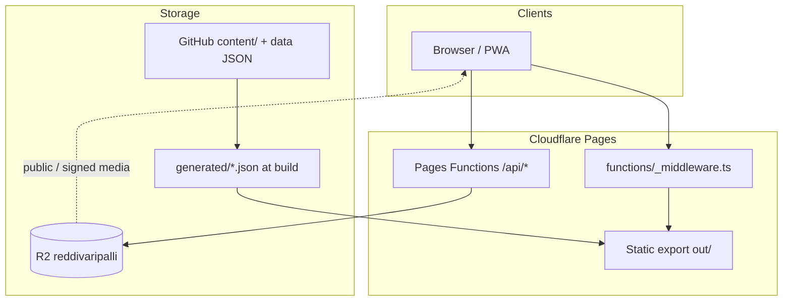

# Architecture

## Layers



## Static app shell

- Next.js builds with `output: "export"` → `out/` ([`next.config.ts`](../next.config.ts)).
- Catch-all routes live in [`app/[...slug]/page.tsx`](../app/[...slug]/page.tsx) (gallery years, festivals, admin, login, settings, offline, etc.).
- Site identity, nav, and SEO constants: [`lib/site.ts`](../lib/site.ts).
- Design tokens: `styles/tokens.css`, `lib/design-tokens.ts`.

## Edge layer (Pages Functions)

| Path | Role |
|---|---|
| `functions/_middleware.ts` | Canonical host redirect; Fun Fest path gate |
| `functions/api/admin/[[route]].ts` | Super Admin login / session / logout |
| `functions/api/auth/*` | Fun Fest member login / session / logout |
| `functions/api/community/[[route]].ts` | R2 JSON collections CRUD |
| `functions/api/media/[[route]].ts` | Upload, sign, stream objects |

Binding: R2 bucket **`MEDIA`** → `reddivaripalli` ([`wrangler.toml`](../wrangler.toml)).

## Content pipeline (build time)

```text
content/<YEAR>/<bucket>/  +  content/data/*.json
        │
        ▼
  scripts/sync-cms.ts  →  generated/albums.json (+ warnings)
        │
        ▼
  prepare:site (logos, music, member-auth, generate-all, rewrite-albums-r2)
        │
        ▼
  next build → out/
        │
        ▼
  media:strip-local (if NEXT_PUBLIC_R2_PUBLIC_URL set)
        │
        ▼
  wrangler pages deploy
```

Album CMS writes are **not** done via the admin API (returns 403 with a pointer to Git / community API). Live community data uses `/api/community/*`.

## Community data

- Seed files: `content/data/{members,directory,heritage,lost-found,panchayat-docs,site-settings,...}.json`
- Live store keys: `community/<collection>.json` in R2
- Client hook: [`lib/use-community.ts`](../lib/use-community.ts)
- Collections (code): `directory`, `members`, `lost-found`, `panchayat-docs`, `heritage`, `site-settings`, `analytics`, `audit`

Approval-gated public reads: **lost-found**, **heritage** (non-admin sees `status === "approved"` only).

## Auth model

| Role | Cookie | Login | Capabilities (actual) |
|---|---|---|---|
| Guest | — | — | Public pages |
| Member | `rvp_member` (HttpOnly, 7d) | `/api/auth/login` | Fun Fest; pending submissions |
| Super Admin | `rvp_admin` (HttpOnly, 24h) | `/api/admin/login` | R2 upload, community PUT/DELETE, Edit Mode |

Capability matrix intent: [`lib/roles.ts`](../lib/roles.ts). Some “admin manage-*" items are UI/Git workflows rather than full API surfaces.

## Media model

- Public gallery/heroes/members → R2 public base (`NEXT_PUBLIC_R2_PUBLIC_URL` / `R2_PUBLIC_BASE`)
- Private prefixes (`funfest/`, `documents/`, `/private/`) → signed `/api/media/object?...`
- Local strip before deploy preserves route HTML (e.g. `out/members/index.html`)

## Related

[SYSTEM_DIAGRAMS.md](./SYSTEM_DIAGRAMS.md) · [API_REFERENCE.md](./API_REFERENCE.md) · [DATABASE.md](./DATABASE.md) · [AUTHENTICATION.md](./AUTHENTICATION.md)
