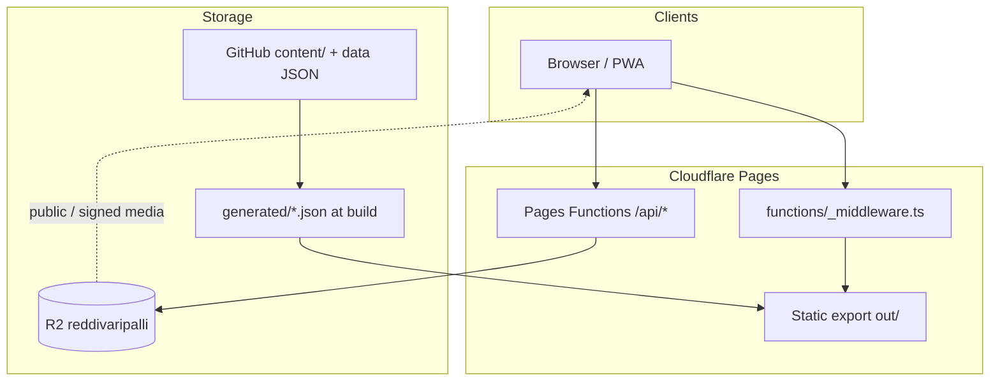

# Architecture

## Layers



## Static app shell

- Next.js builds with `output: "export"` → `out/` ([`next.config.ts`](../next.config.ts)).
- Catch-all routes live in [`app/[...slug]/page.tsx`](../app/[...slug]/page.tsx) (gallery years, festivals, admin, login, settings, offline, etc.).
- Site identity, nav, and SEO constants: [`lib/site.ts`](../lib/site.ts).
- Design tokens: `styles/tokens.css`, `lib/design-tokens.ts`.

## Edge layer (Pages Functions)

| Path | Role |
|---|---|
| `functions/_middleware.ts` | Canonical host redirect; Fun Fest path gate |
| `functions/api/admin/[[route]].ts` | Super Admin login / session / logout |
| `functions/api/auth/*` | Fun Fest member login / session / logout |
| `functions/api/community/[[route]].ts` | R2 JSON collections CRUD |
| `functions/api/media/[[route]].ts` | Upload, sign, stream objects |

Binding: R2 bucket **`MEDIA`** → `reddivaripalli` ([`wrangler.toml`](../wrangler.toml)).

## Content pipeline (build time)

```text
content/<YEAR>/<bucket>/  +  content/data/*.json
        │
        ▼
  scripts/sync-cms.ts  →  generated/albums.json (+ warnings)
        │
        ▼
  prepare:site (logos, music, member-auth, generate-all, rewrite-albums-r2)
        │
        ▼
  next build → out/
        │
        ▼
  media:strip-local (if NEXT_PUBLIC_R2_PUBLIC_URL set)
        │
        ▼
  wrangler pages deploy
```

Album CMS writes are **not** done via the admin API (returns 403 with a pointer to Git / community API). Live community data uses `/api/community/*`.

## Community data

- Seed files: `content/data/{members,directory,heritage,lost-found,panchayat-docs,site-settings,...}.json`
- Live store keys: `community/<collection>.json` in R2
- Client hook: [`lib/use-community.ts`](../lib/use-community.ts)
- Collections (code): `directory`, `members`, `lost-found`, `panchayat-docs`, `heritage`, `site-settings`, `analytics`, `audit`

Approval-gated public reads: **lost-found**, **heritage** (non-admin sees `status === "approved"` only).

## Auth model

| Role | Cookie | Login | Capabilities (actual) |
|---|---|---|---|
| Guest | — | — | Public pages |
| Member | `rvp_member` (HttpOnly, 7d) | `/api/auth/login` | Fun Fest; pending submissions |
| Super Admin | `rvp_admin` (HttpOnly, 24h) | `/api/admin/login` | R2 upload, community PUT/DELETE, Edit Mode |

Capability matrix intent: [`lib/roles.ts`](../lib/roles.ts). Some “admin manage-*" items are UI/Git workflows rather than full API surfaces.

## Media model

- Public gallery/heroes/members → R2 public base (`NEXT_PUBLIC_R2_PUBLIC_URL` / `R2_PUBLIC_BASE`)
- Private prefixes (`funfest/`, `documents/`, `/private/`) → signed `/api/media/object?...`
- Local strip before deploy preserves route HTML (e.g. `out/members/index.html`)

## Related

[SYSTEM_DIAGRAMS.md](./SYSTEM_DIAGRAMS.md) · [API_REFERENCE.md](./API_REFERENCE.md) · [DATABASE.md](./DATABASE.md) · [AUTHENTICATION.md](./AUTHENTICATION.md)

---

# Phase 0 Addendum — Target Architecture

**Appended:** 2026-08-28. Everything above describes the system as it is and remains
accurate; nothing above was edited. This section describes where it goes and what
changes. **Nothing here is implemented.**

## Decision: keep the stack

Audited against the full platform vision (learning, kids, games, agriculture, weather,
careers, government information, universal search, voice, AI). **No blocker was found.**

| Layer | Decision |
|---|---|
| Next.js 16 App Router, static export | **Keep.** Free, no cold start, survives traffic spikes, degrades well on slow networks |
| React 19, TypeScript strict | **Keep** |
| Tailwind v4 + tokens | **Keep.** The token file is genuinely good |
| Cloudflare Pages | **Keep.** Unlimited requests, 500 builds/month, free |
| Pages Functions | **Keep.** The only server-side code, and sufficient |
| R2 | **Keep** for media and blobs. 10 GB free, no egress fees |
| KV | **Keep** for rate limits and ephemeral cache |
| Git-as-CMS | **Keep and extend.** Reviewable in a diff, versioned, free |
| **D1** | **Add**, only where mutable structured state is genuinely required |

## The three structural changes

### 1 · Telugu route segments

`app/te/` mirroring the existing catch-all. Additive; no existing route file is touched.
Full mapping and rationale in [ROUTE_MIGRATION.md](./ROUTE_MIGRATION.md).

The larger per-section route tree is **deliberately deferred** until the section count
justifies it (Phase 3+). Splitting the router and adding a language at the same time
doubles the risk of both.

### 2 · A typed content layer

Courses, lessons, crops, schemes, services and games are **data**, not components.
Authored under `content/`, validated against a schema at build time, indexed by one
generator. A course becomes a folder, not a route file.

Every factual record carries the same provenance block, enforced by the schema:

```
source · sourceUrl · author · reviewer · lastVerified · notes
```

**A government scheme, job or agriculture guide without provenance fails the build.**
This is the mechanism that makes "no fabricated content" a property of the system rather
than a promise.

### 3 · D1 for structured state

The current model — one JSON object per collection in R2, read and rewritten whole, no
transactions, last-write-wins — is fine for a directory of forty entries. It is not a
place for game scores, quiz attempts, content reports or a moderation queue.

Free tier: 5 GB storage, 5 million row reads per day. Pages Functions bind to D1
directly; the front end stays static and calls `/api/*`.

## Data placement

| Data | Store | Why |
|---|---|---|
| Village pages, courses, lessons, kids content, game metadata, agriculture guides, temple and heritage records, government information, curated video, career resources | **Git `content/`** | Editorial, versioned, reviewable in a PR, zero runtime cost |
| Images, video, documents, large media | **R2** | Unchanged |
| Game scores, aggregate leaderboards, reports, submissions, moderation state, audit log, admin state | **D1** | Needs rows, queries, status transitions |
| Rate limits, feature flags, ephemeral cache | **KV** | Unchanged |
| Player nickname, game progress, course progress, badges, streaks, preferences | **localStorage** | **No account required** — the product rule, enforced by the architecture |

Existing collections (members, directory, events, developments, heritage, documents)
**stay in R2 for now**. Migrate only if and when the admin workflow needs it — not as
part of introducing D1.

## Server typechecking decision

`tsconfig.json` excludes `functions/`, so 2,273 lines of auth, session, upload and
community-write code have never been typechecked. Removing the exclusion is unsafe:
Workers globals (`R2Bucket`, `KVNamespace`) are not declared in the Next config, and
`next build` would try to check them under DOM/Node libs.

**Decision — a second config**, leaving `tsconfig.json` untouched:

- New `tsconfig.functions.json` with `lib: ["ES2022", "WebWorker"]` and
  `types: ["@cloudflare/workers-types"]`
- `include` must cover the `lib/` modules the Functions import — `lib/r2-catalog.ts`,
  `lib/cms.ts`, `lib/media-pipeline/*` — so those compile under both configs
- `"typecheck": "tsc --noEmit && tsc --noEmit -p tsconfig.functions.json"`
- One dev dependency: `@cloudflare/workers-types`

**Expect errors on the first run.** Fix them as a separate reviewed commit, not folded
into the config change. Full reasoning in [BASELINE.md](./BASELINE.md) § 8.

## Search

Today: one flat array built inline in `scripts/generate-all.ts`, a different ad-hoc
shape per kind, lowercase `includes()` matching, English only, 357 KB loaded whole.

Target: a typed `SearchDoc` schema every section emits into, a scored matcher (exact
title → title prefix → tag → body), Telugu bigram normalisation, and a small
transliteration table for the names people actually type (Ramalayam ↔ రామాలయం).
Sharding by section is wired but emits a single shard until the index outgrows it.

**No search library is added.** Gzipped the index is 25 KB and a scored matcher over 700
documents runs in under a millisecond. Revisit at Phase 3 when the index passes a few
thousand documents — the schema is designed so that swap is a matcher change, not a
content change.

## Weather

Open-Meteo — free, no API key, no attribution requirement. IMD public feeds for severe
weather alerts. Village centroid as the default location; **precise user coordinates are
never stored**, and "use my location" rounds before use.

Weather may provide *context* to agriculture answers. It must never trigger an
automatic reminder.

## Agriculture

Content-first and deterministic. Crop guides are versioned records with sources. The
"what should I do?" flow is a decision tree over crop × stage × season × water
availability × current weather — a data structure a domain expert can review, not a
generative model.

Image upload returns "possible matches, get this confirmed", never a diagnosis.
**Chemical, pesticide and fertiliser dosages are never generated.** Either the guide
cites a specific ICAR / state department / KVK document, or it says to consult the local
KVK and gives the number.

## AI and voice — Phase 6, optional

```
user question → search platform index → retrieved passages → grounded answer + citations
```

Retrieval first, always. The model phrases an answer from retrieved passages and shows
what it cited. **If nothing is retrieved, it says so rather than answering.** The
platform must work fully with AI switched off, and there must be a "no AI configured"
path that still helps.

Voice uses the browser Web Speech API — free, no service, `te-IN` support varies by
device, so feature-detect and hide the control when absent.

## What was ruled out

| Considered | Rejected because |
|---|---|
| Move off static export to SSR | Would add cost and cold starts for no capability the platform needs |
| Replace R2 JSON with D1 wholesale | Working data, no need, violates "reuse existing structures" |
| A search library (Pagefind, Fuse, Lunr) | Dependency chosen before the problem exists |
| Workbox | Would replace 40 lines of understood service worker with a generated abstraction |
| An i18n library (`next-intl`, `i18next`) | 40 KB+ for features the catalogue does not need |
| A full router rewrite in the first phase | Rule: no rewrite without proof. The proof arrives at Phase 3 |
