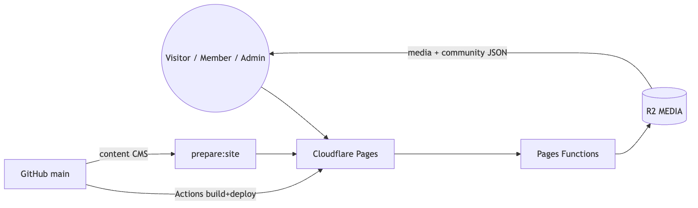
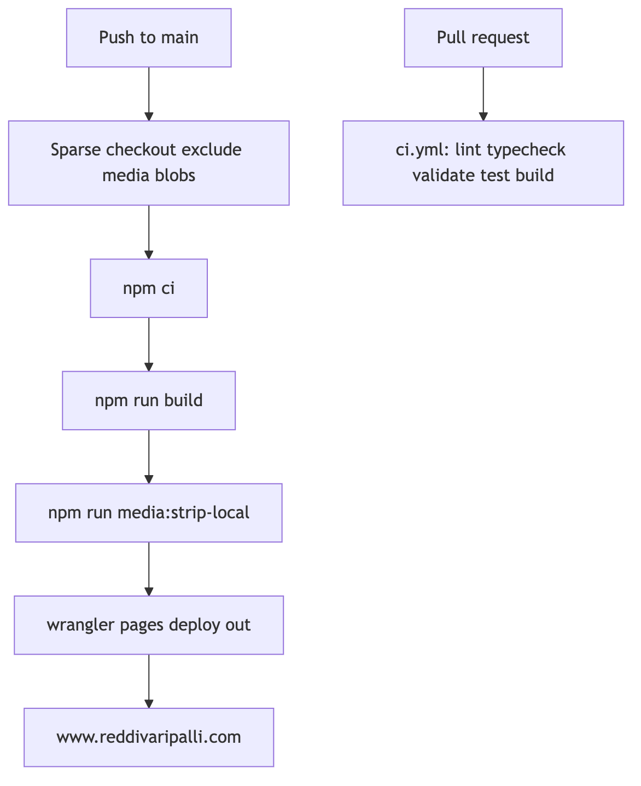
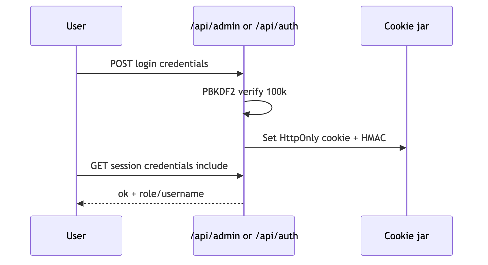
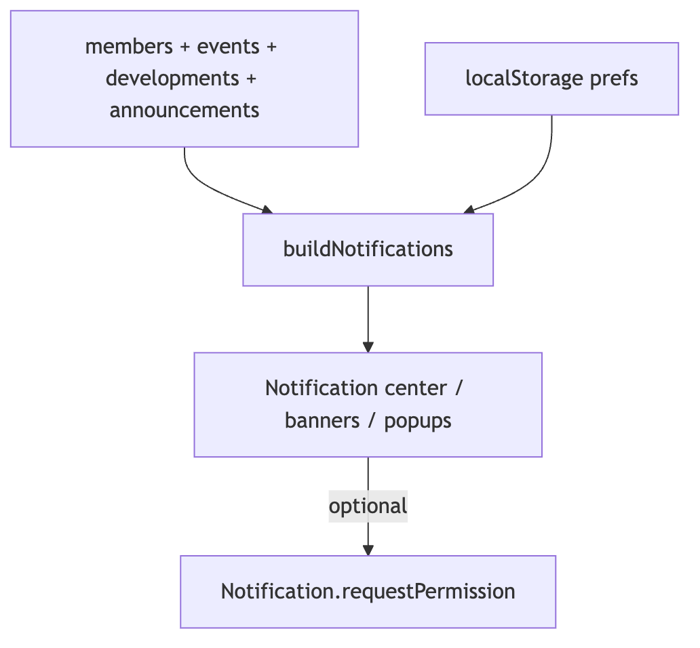
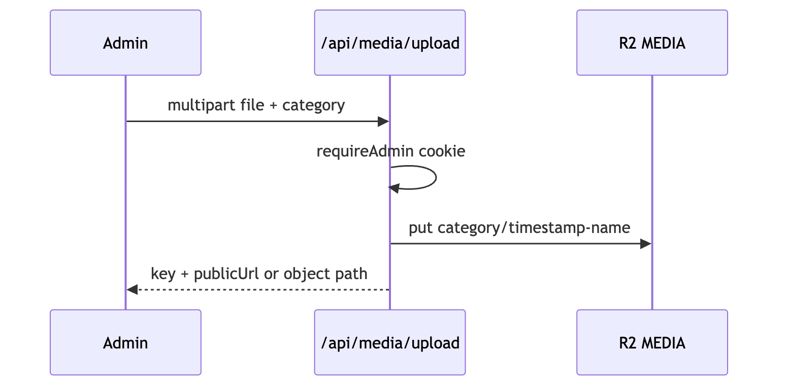
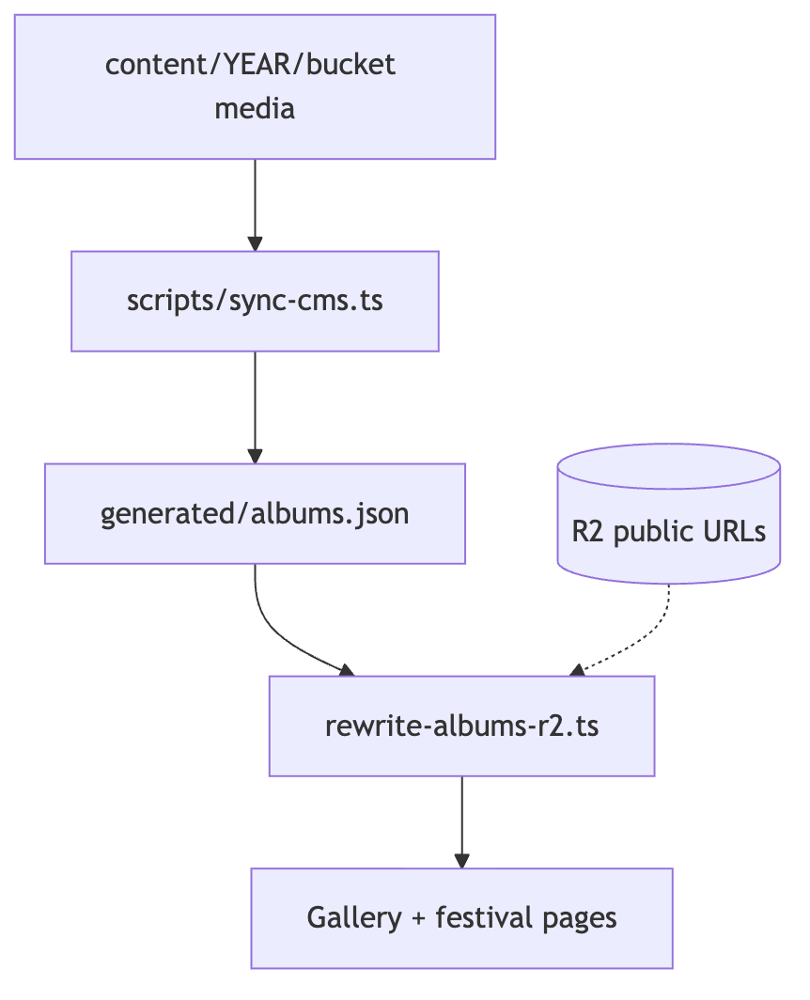
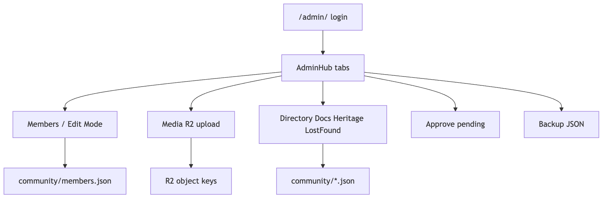
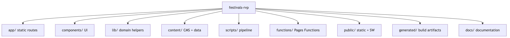

# Reddivaripalli Village Portal — Documentation

Official documentation for the **Reddivaripalli Gram Panchayat** digital identity, stewarded by **RVP Youth**.

| | |
|---|---|
| Live site | [https://www.reddivaripalli.com](https://www.reddivaripalli.com) |
| Cloudflare Pages | [https://festivals-rvp.pages.dev](https://festivals-rvp.pages.dev) |
| Repository | [github.com/ggovardhanreddy/festivals-rvp](https://github.com/ggovardhanreddy/festivals-rvp) |
| Version | **1.2.0** (`package.json`) |

## Project summary

This is a **Next.js static export** (App Router) deployed to **Cloudflare Pages**, with large media and live community JSON stored in **Cloudflare R2**. GitHub remains the CMS for annual festival albums under `content/<YEAR>/<album>/`. Super Admin manages members, directory, documents, approvals, and R2 uploads via Pages Functions. Fun Fest (`/fun-trips/`) is member-gated with first-name style credentials.

## Documentation index

### Start here

| Doc | Description |
|---|---|
| [PROJECT_OVERVIEW.md](./PROJECT_OVERVIEW.md) | Mission, audiences, what the portal includes |
| [ARCHITECTURE.md](./ARCHITECTURE.md) | System layers, data flow, key modules |
| [SYSTEM_DIAGRAMS.md](./SYSTEM_DIAGRAMS.md) | Mermaid diagrams (architecture, auth, deploy, media) |
| [TECH_STACK.md](./TECH_STACK.md) | Runtime, libraries, tooling versions |

### Setup & operations

| Doc | Description |
|---|---|
| [INSTALLATION.md](./INSTALLATION.md) | Prerequisites and first install |
| [DEVELOPMENT_SETUP.md](./DEVELOPMENT_SETUP.md) | Local workflows, scripts, env vars |
| [DEPLOYMENT.md](./DEPLOYMENT.md) | Deploy paths, CI, secrets checklist |
| [CLOUDFLARE_PAGES.md](./CLOUDFLARE_PAGES.md) | Pages project, domain, Functions |
| [CLOUDFLARE_R2.md](./CLOUDFLARE_R2.md) | Bucket layout, migration, strip-local |

### Product guides

| Doc | Description |
|---|---|
| [ADMIN_GUIDE.md](./ADMIN_GUIDE.md) | Super Admin dashboard & Edit Mode |
| [MEMBER_GUIDE.md](./MEMBER_GUIDE.md) | Fun Fest login & member capabilities |
| [GALLERY_GUIDE.md](./GALLERY_GUIDE.md) | Albums, years, CMS folders |
| [EVENTS_GUIDE.md](./EVENTS_GUIDE.md) | Events JSON & reminders |
| [FESTIVALS_GUIDE.md](./FESTIVALS_GUIDE.md) | Culture festivals & chapter pages |
| [DEVELOPMENTS_GUIDE.md](./DEVELOPMENTS_GUIDE.md) | Village projects & milestones |
| [NOTIFICATIONS.md](./NOTIFICATIONS.md) | In-app notification center |
| [PWA.md](./PWA.md) | Install, service worker, updates |
| [SEO.md](./SEO.md) | Metadata, sitemap, structured data |

### Engineering reference

| Doc | Description |
|---|---|
| [AUTHENTICATION.md](./AUTHENTICATION.md) | Super Admin + Fun Fest auth |
| [SECURITY.md](./SECURITY.md) | Secrets, cookies, private media |
| [DATABASE.md](./DATABASE.md) | JSON / R2 stores (no SQL DB) |
| [API_REFERENCE.md](./API_REFERENCE.md) | Pages Functions routes |
| [MEDIA_MANAGEMENT.md](./MEDIA_MANAGEMENT.md) | Import, sync, R2, signed URLs |
| [BACKUP_AND_RESTORE.md](./BACKUP_AND_RESTORE.md) | Community JSON backups |
| [TROUBLESHOOTING.md](./TROUBLESHOOTING.md) | Common failures |
| [FAQ.md](./FAQ.md) | Short answers |
| [CHANGELOG.md](./CHANGELOG.md) | Release history |

### Diagrams

Sources and renders live in [`diagrams/`](./diagrams/) (`.mmd` + committed `.png` / `.svg`):

| File | Topic |
|---|---|
| `architecture.mmd` / `.png` / `.svg` | High-level system |
| `deployment.mmd` / `.png` / `.svg` | CI → Pages deploy |
| `authentication.mmd` / `.png` / `.svg` | Admin + member sessions |
| `notification-flow.mmd` / `.png` / `.svg` | Client notification build |
| `upload-flow.mmd` / `.png` / `.svg` | Admin → R2 upload |
| `gallery-flow.mmd` / `.png` / `.svg` | Git CMS → albums |
| `admin-workflow.mmd` / `.png` / `.svg` | Super Admin tasks |
| `project-structure.mmd` / `.png` / `.svg` | Repo layout |

**Preview**

















**Render Mermaid locally** (if PNG/SVG are missing or outdated). `-p` must be a Puppeteer JSON config (not the Chrome binary path):

```bash
cat > /tmp/mmdc-puppeteer.json <<'EOF'
{
  "executablePath": "/Applications/Google Chrome.app/Contents/MacOS/Google Chrome",
  "args": ["--no-sandbox", "--disable-setuid-sandbox"]
}
EOF

for f in docs/diagrams/*.mmd; do
  npx --yes @mermaid-js/mermaid-cli -i "$f" -o "${f%.mmd}.png" -b transparent -p /tmp/mmdc-puppeteer.json -s 2
  npx --yes @mermaid-js/mermaid-cli -i "$f" -o "${f%.mmd}.svg" -b transparent -p /tmp/mmdc-puppeteer.json
done
```

Diagrams are also embedded as PNGs (and Mermaid source) in [SYSTEM_DIAGRAMS.md](./SYSTEM_DIAGRAMS.md) and [ARCHITECTURE.md](./ARCHITECTURE.md).

### Design & governance (numbered legacy docs)

These remain for design-system and acceptance detail:

[00 Master Prompt](./00-MASTER_PROMPT.md) · [01 Architecture](./01-ARCHITECTURE.md) · [02 Design System](./02-DESIGN_SYSTEM.md) · [03 UI/UX](./03-UI_UX.md) · [04 Animations](./04-ANIMATIONS.md) · [05 3D](./05-3D_EXPERIENCE.md) · [06 Gallery](./06-GALLERY.md) · [07 Media Pipeline](./07-MEDIA_PIPELINE.md) · [08 Deployment](./08-DEPLOYMENT.md) · [09 Coding Standards](./09-CODING_STANDARDS.md) · [10 Testing](./10-TESTING.md) · [11 Roadmap](./11-FUTURE_ROADMAP.md) · [12 Acceptance](./12-ACCEPTANCE_CRITERIA.md) · [13 R2 Media](./13-R2_MEDIA.md) · [14 Admin](./14-ADMIN_GUIDE.md) · [Brand](./13-BRAND_IDENTITY.md)

When guidance conflicts, prefer the unnumbered docs in this index (they track the current **1.2.0** codebase).

## Root operator docs

Also see repo root: [README.md](../README.md) · [CONTENT_GUIDE.md](../CONTENT_GUIDE.md) · [CONTRIBUTING.md](../CONTRIBUTING.md) · [DEPLOYMENT.md](../DEPLOYMENT.md) · [TROUBLESHOOTING.md](../TROUBLESHOOTING.md) · [CHANGELOG.md](../CHANGELOG.md) · [.env.example](../.env.example)
