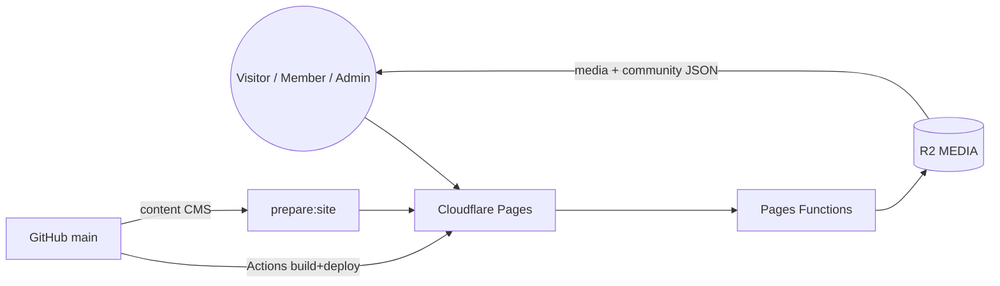
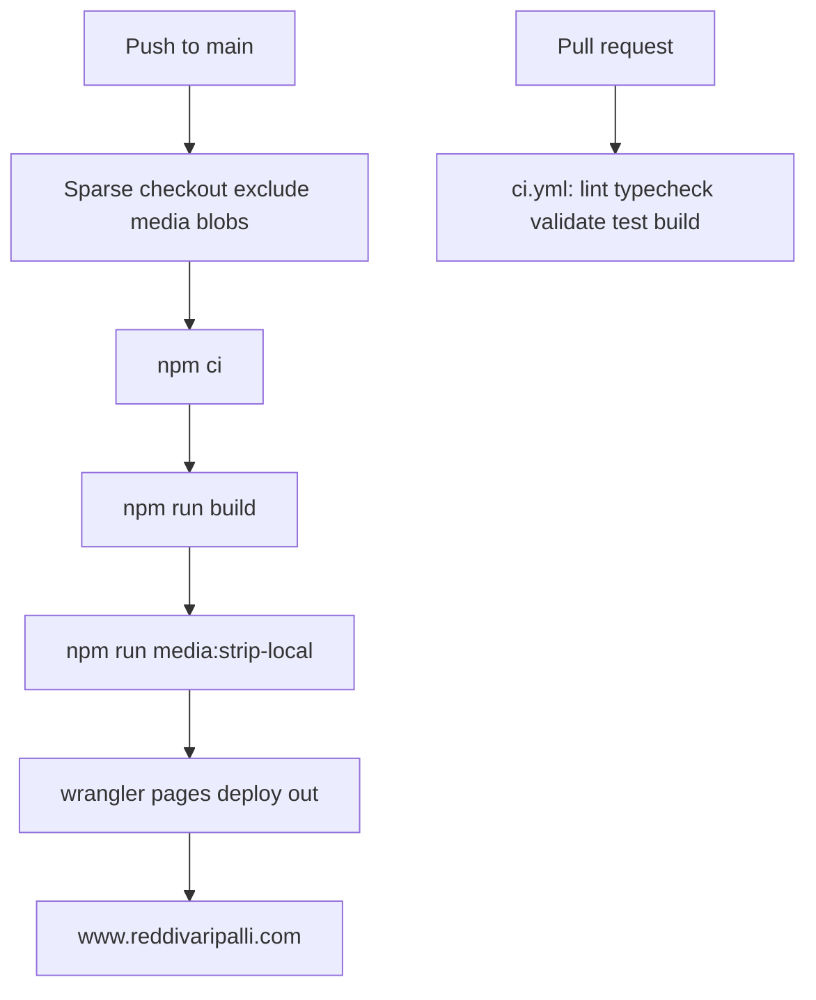
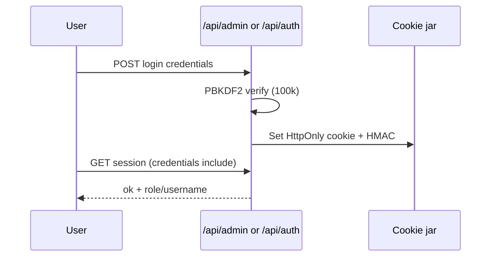
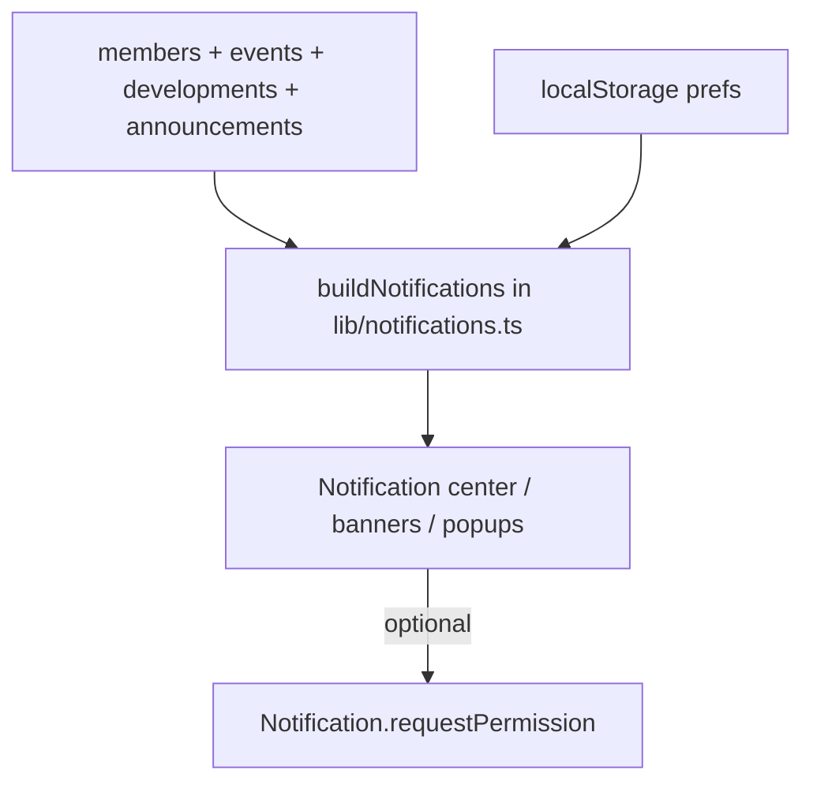
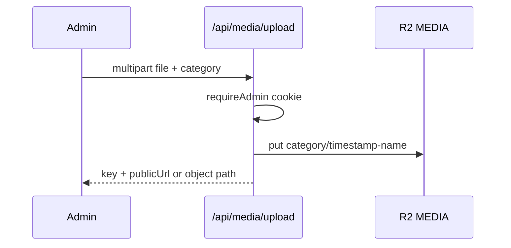
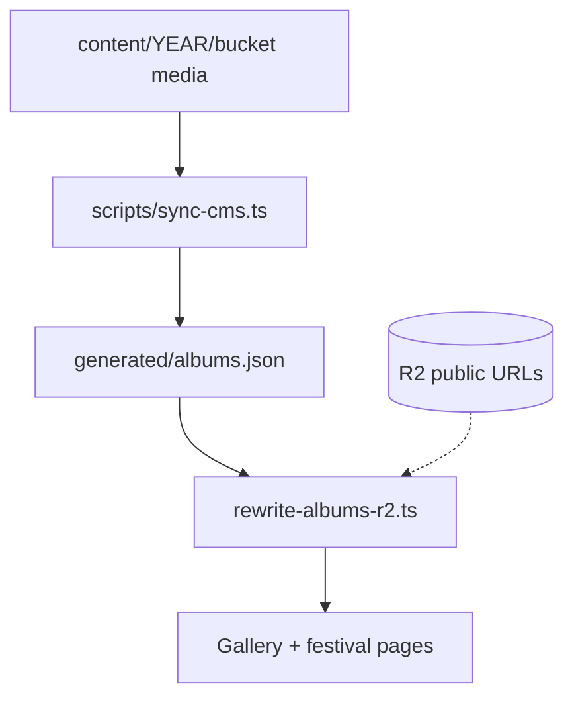
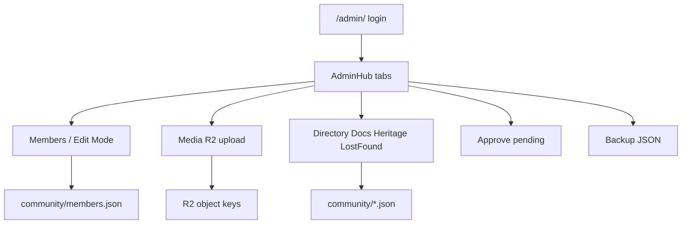
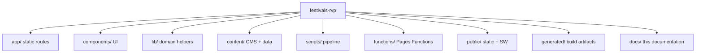

# System Diagrams

Mermaid sources and rendered PNG/SVG live in [`diagrams/`](./diagrams/). Render instructions: [README.md](./README.md#diagrams).

## Architecture

## Deployment

## Authentication

## Notification flow

## Upload flow (Super Admin)

## Gallery / CMS flow

## Admin workflow

## Project structure

## File map

| Diagram | Source | PNG |
|---|---|---|
| Architecture | [architecture.mmd](./diagrams/architecture.mmd) | [architecture.png](./diagrams/architecture.png) |
| Deployment | [deployment.mmd](./diagrams/deployment.mmd) | [deployment.png](./diagrams/deployment.png) |
| Authentication | [authentication.mmd](./diagrams/authentication.mmd) | [authentication.png](./diagrams/authentication.png) |
| Notifications | [notification-flow.mmd](./diagrams/notification-flow.mmd) | [notification-flow.png](./diagrams/notification-flow.png) |
| Upload | [upload-flow.mmd](./diagrams/upload-flow.mmd) | [upload-flow.png](./diagrams/upload-flow.png) |
| Gallery | [gallery-flow.mmd](./diagrams/gallery-flow.mmd) | [gallery-flow.png](./diagrams/gallery-flow.png) |
| Admin | [admin-workflow.mmd](./diagrams/admin-workflow.mmd) | [admin-workflow.png](./diagrams/admin-workflow.png) |
| Structure | [project-structure.mmd](./diagrams/project-structure.mmd) | [project-structure.png](./diagrams/project-structure.png) |
